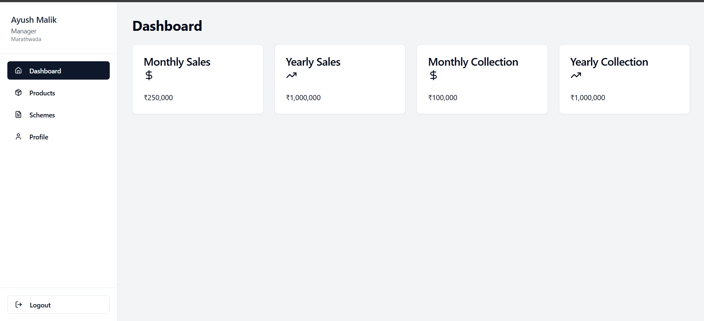
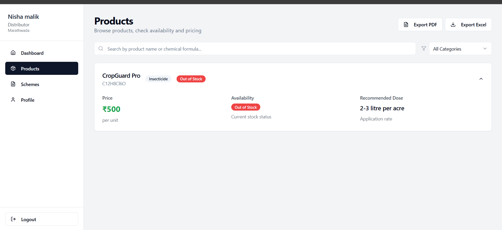
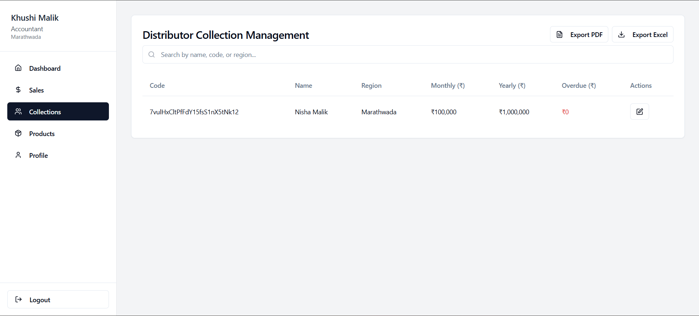
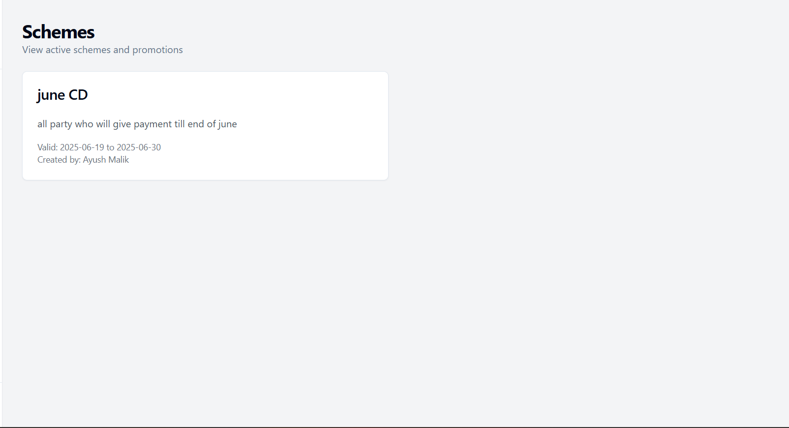

# 🌾 KissanKhata

**KissanKhata** is a role-based web application for **fertilizer product management**, including pricing, stock, schemes, sales, and collection. It streamlines access and actions based on user roles like **Manager**, **Accountant**, **Distributor**, and **Staff**.

🌐 **Live App**: [kissankhata.netlify.app](https://kissankhata.netlify.app/)

---

## 🔑 Features

- 📦 View fertilizer product prices, categories, availability, and dosage
- 🧾 Role-based access to product schemes, sales, and collections
- 🔒 Firebase Authentication with protected routing
- 📊 Firestore integration for real-time updates

---

## 👥 Role-Based Access

| Role         | Access Level                                                                 |
|--------------|------------------------------------------------------------------------------|
| **Manager**     | View & Edit Product Prices, and Schemes                                   |
| **Accountant**  | Update Sales, Collections, and Stock Availability                         |
| **Distributor** | View Products, Schemes, and Sales related to them                         |
| **Staff**       | View Product Prices, Schemes, and Region-wise Distributor Sales           |

---

## 🚀 Tech Stack

- **Frontend**: React.js, Tailwind CSS
- **Backend**: Firebase Authentication & Firestore
- **Routing**: React Router with Protected Routes
- **Deployment**: Netlify

---

## 📸 Screenshots

> Make sure to upload your screenshots in a `screenshots/` folder and use the following filenames.

### 🏠 Dashboard View (Role-based)


### 📦 Product Section


### 💰 Sales & Collections



### Schemes


---

## 📁 Folder Structure

```bash
KissanKhata/
├── public/
├── src/
│   ├── components/
│   ├── pages/
│   ├── context/
│   ├── firebase.js
│   ├── App.jsx
│   ├── main.jsx
├── .gitignore
├── index.html
├── package.json
├── tailwind.config.js
└── README.md
